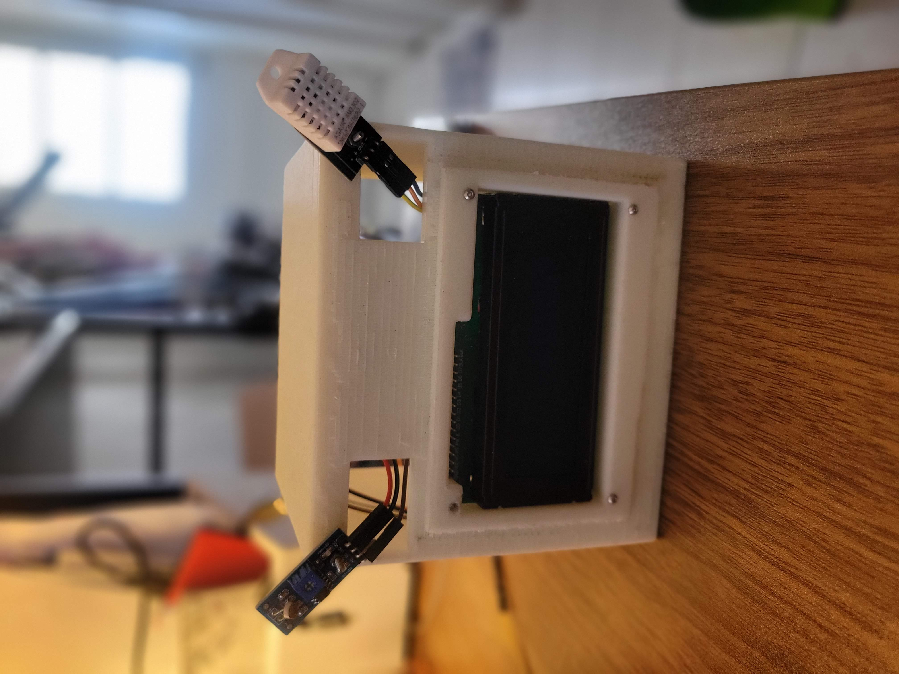
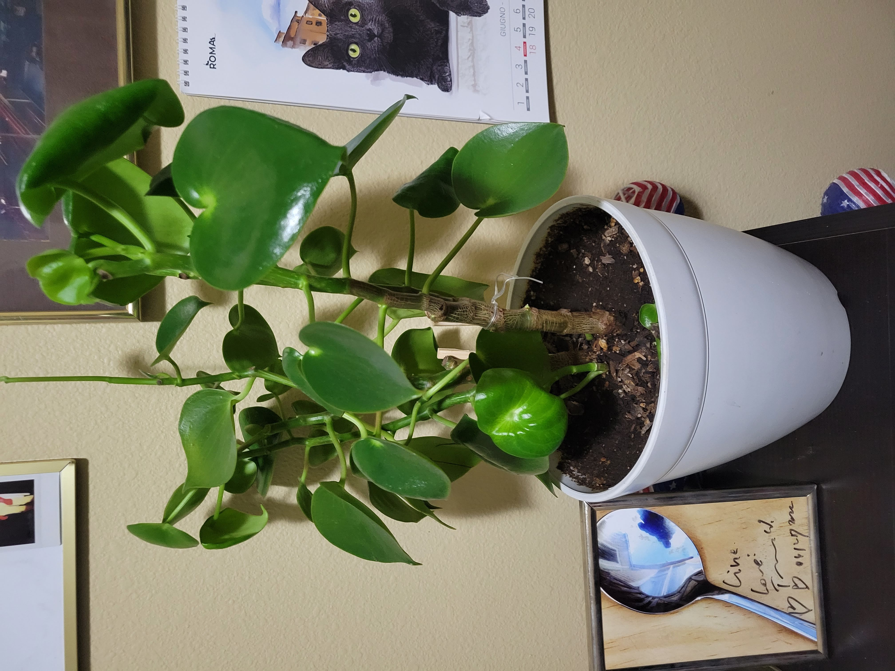
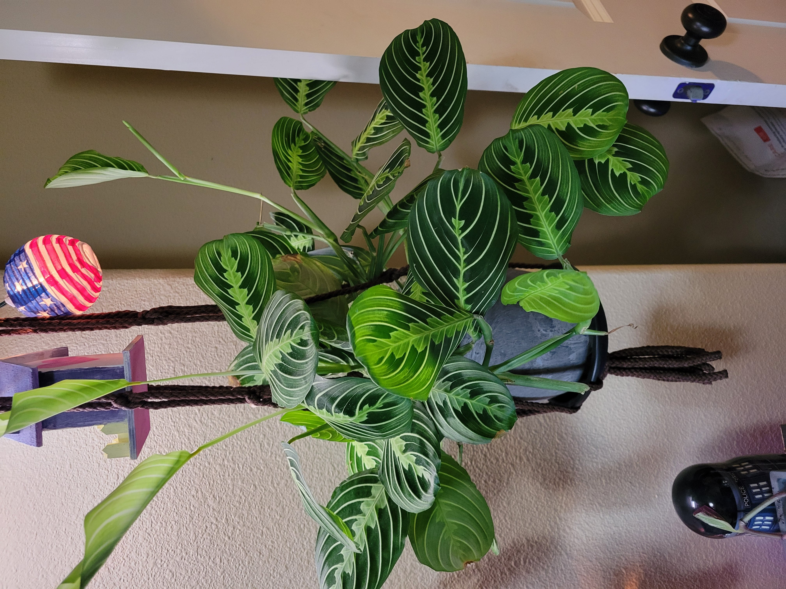
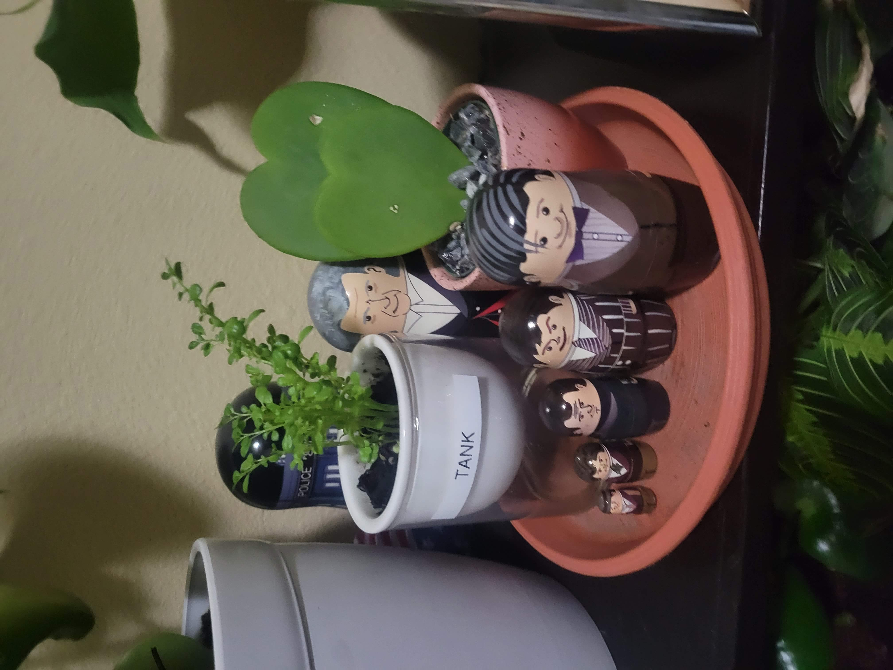
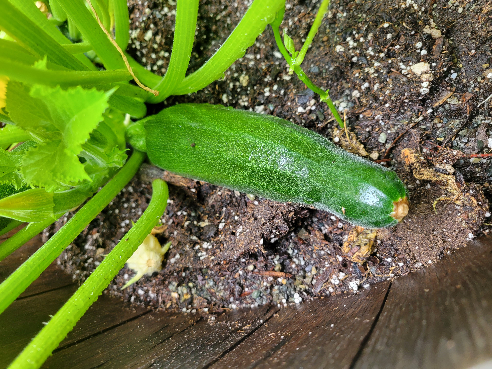
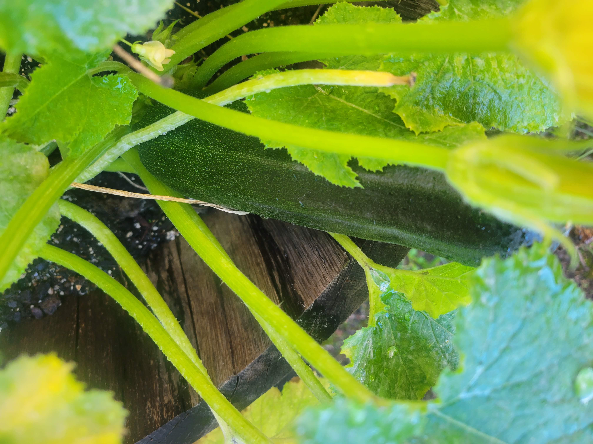

##### Description
I love to garden and have spent the past several years learning more and more about plants, both indoor and outdoor. While many DIY automation systems exist for monitoring and watering plants, I wanted to develop my own to be able to tailor it to my needs.

My current favorite plant is the peperomia plant. 

#### DIY Watering Automation

This project is set up with an Arduino Nano and multiple sensors to track moisture, light, and temperature levels. Data is logged to a csv file and can be evaluated to determine watering frequency and how quickly moisture level changes. I designed and 3D printed a housing for the setup with some glow-in-the-dark filament to make a fun face-like housing. 

The second part of the project involves adding the automated watering when moisture levels reach a certain amount. I am aiming to continue to add additional components and optimize the wiring and code for simpler use.

A github will be available when the system is completed.

#### Some of my plants

---

