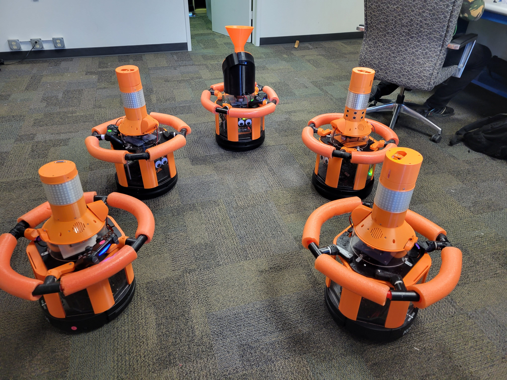
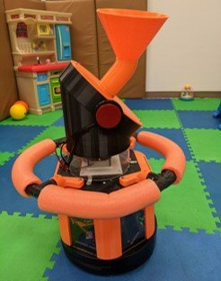
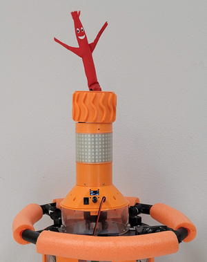
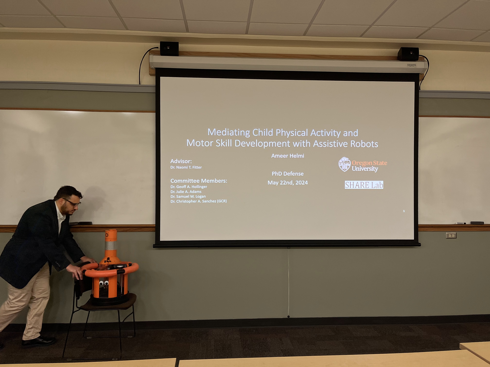
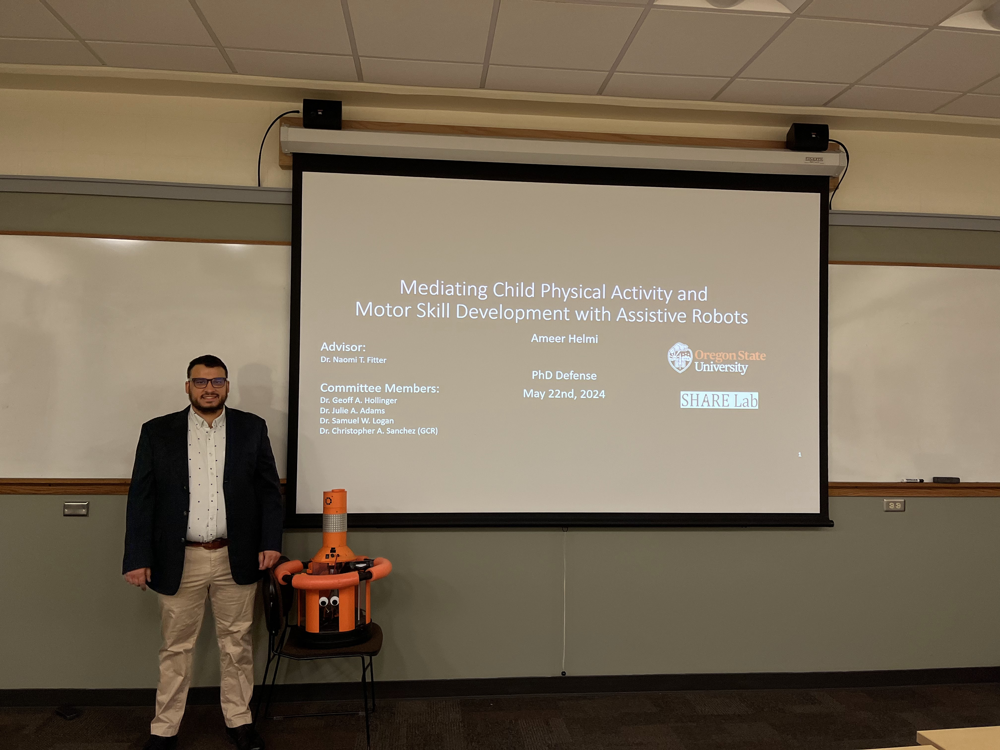
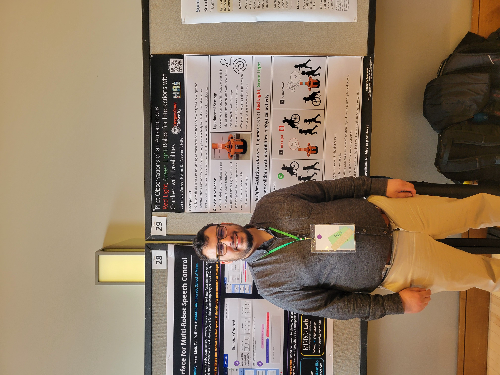
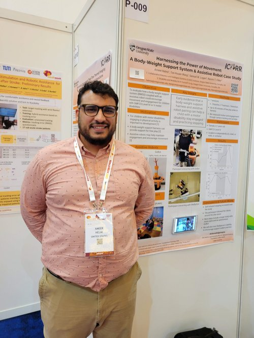
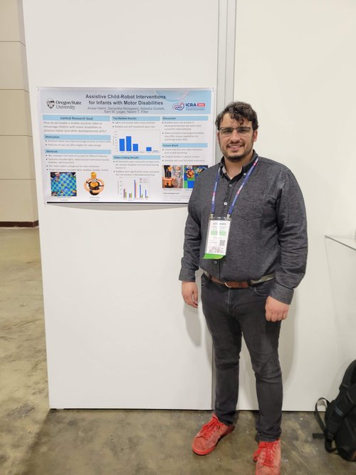
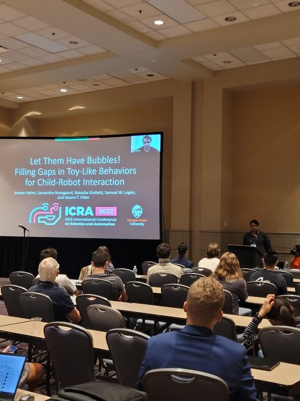

##### Description
For the main thrust of my dissertation, I designed, crafted, and iterated upon GoBot, a custom mobile assistive robot aimed at promoting physical activity for children with and without disabilities. GoBot is modular, meaning that reward hardware can be hot swapped to increase engagement and personalization in long-term interactions. 

The base version of GoBot is constructed on a Turtlebot2 base running Python3 with ROS and has a custom 3D-printed reward stack with lights, bubbles, and sounds for promoting engagement and physical activity. GoBot can be teleoperated, or operate with semi or full autonomy. We use a LIDAR sensor and a custom overhead camera sensing system to enable autonomy in GoBot. We constructed GoBot and its many modular hardware components with multiple teams of undergraduate capstone teams and Research Experience for Undergraduates (REU) students. For example, we designed a ball launching module as well as a wacky waving inflatable tube man module:

Ball Launcher            |  Air Dancer
:-------------------------:|:-------------------------:
  |   

The fully autonomous GoBot uses Behavior Trees to determine robot actions which are most likely to encourage children to move towards the robot and continue interacting.

GoBot was studied across multiple long-term child-robot interaction studies, the details of which are linked in the [papers](/papers) page.

--- 

#### Videos
<video width="640" height="264" muted autoplay webkit-playsinline src="bubble_clip.mp4"></video>

<video width="640" height="264" muted autoplay webkit-playsinline src="button_1-1.mp4"></video>

---

### Presentations
 
 
 
 

---