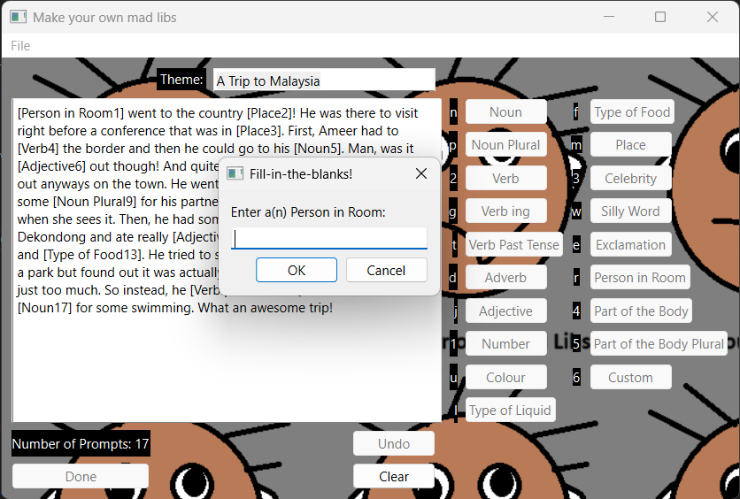

##### Description
I love doing mad libs, especially getting their multitude of themed ones, so I started writing my own a year ago. This gave me the idea to build my own application in Python so that I could store them for future nostalgia. I was also curious what ChatGPT could do with creating mad libs so I integrated the API and ChatGPT 4.0 into the application so that it could make mad libs too. Feel free to 

The mad libs application allows you to write your own mad lib and include the fill-in-the-blanks of your choice or use ChatGPT to generate a mad lib based on your choice of a theme. Generated mad libs can be saved and re-opened for endless fun! It was written entirely in Python and used the OpenAI API as well as PyQT6. The full details can be seen on the public [github](https://github.com/amhelmi/mad_libs_app). 

Support the mad libs company! [madlibs.com](https://madlibs.com)

---

#### Example

---

##### Download

+ [Github](https://github.com/amhelmi/mad_libs_app)

---
