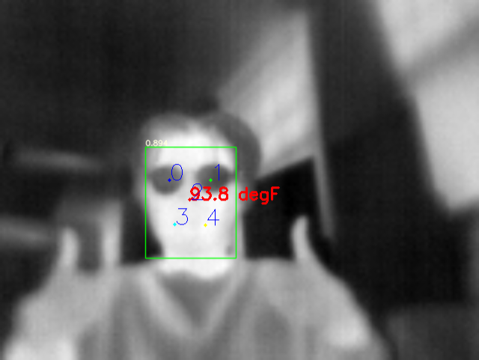
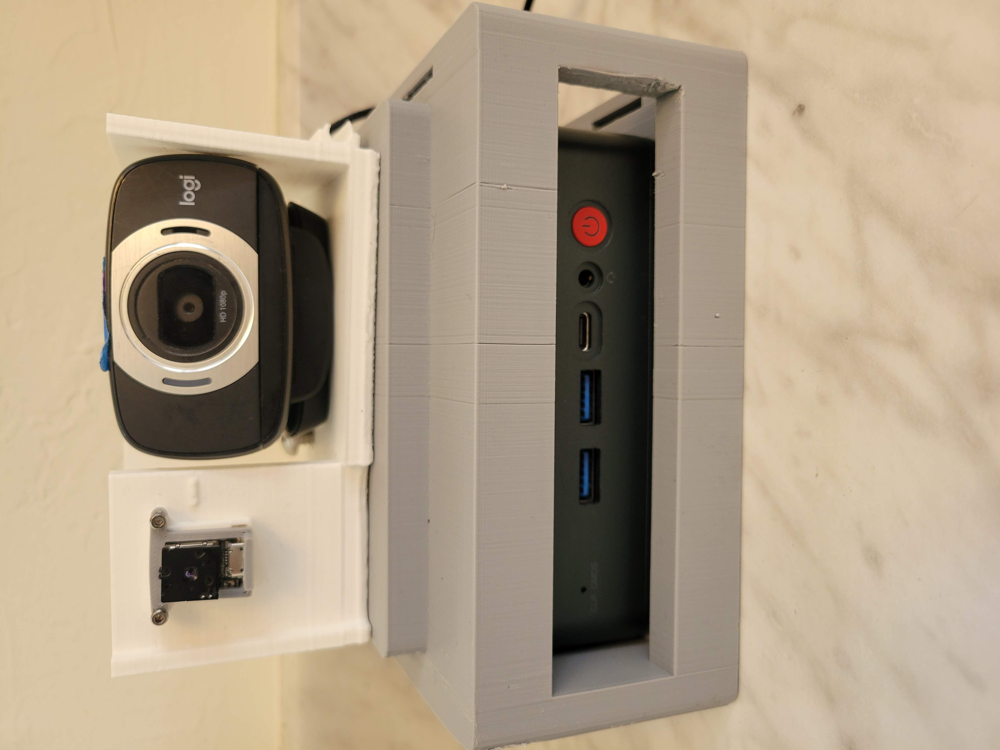

##### Description
For the last portion of my disseration, I developed models for gauging child affect through cost effective thermal imaging. 

Child affect can be very difficult to determine as children can’t self-report their emotions. Employing biological signals such as the regulation of body temperature can help provide estimates of child affect during interactions with a robot. 

We used a FLIR Lepton 3.5 with OpenCV and custom detection algorithms to locate landmarks of interest and correlate temperature values with affect through machine learning. 

---
